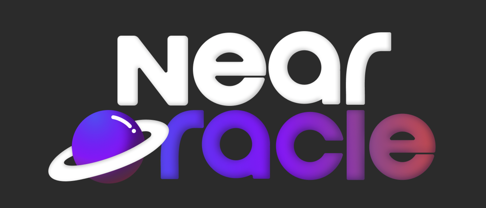
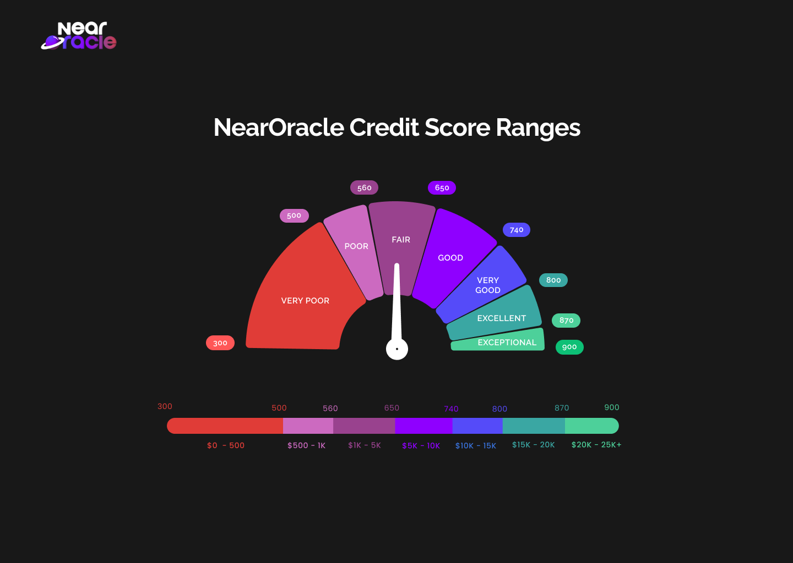

# 💎 🌀 🌐  NEAR Oracle



## At a Glance

NEARoracle is an oracle for credit scoring designed for the web3 community. The oracle returns a numerical score affirming users' credibility and trustworthiness in the web3 space. The DApp was designed with one specific use case in mind: unsecured P2P lending, which is facilitating lending and borrowing of crypto loans.

The DApp works as follow:

- it acquires user's financial data by integrating with two validators ([Plaid](https://dashboard.plaid.com/overview) & [Coinbase](https://developers.coinbase.com/))
- it runs an algorithm on given data to compute a score representing the financial health of a user
- it writes the score to the NEAR Protocol blockchain via a Wasm smart contract build using the Rust `NEAR SDK`

Ultimately, this will incentivize on-chain traffic, it will affirm the reputation of those users requesting a credit score, and it will execute a credit score check to validate their credibility, while also preserving their privacy.

---

## This Repo

This GitHub repo contains the codebase of the NEARoracle credit score algorithm. The code features 2 validators, 3 API integrations, 10 score metrics, and 25+ functions to calculate users' credit scores. The front end of the NEARoracle DApp, after fetching the user's data, passes it to the algorithm to execute and return a score. The Rust smart contract is stored at the [NEARoracle-Oracle](https://github.com/BalloonBox-Inc/NEARoracle-Contract) repo.

## Execute Locally

- download or clone the repo to your machine
- install dependancies
- set up `.env` file
- execute

### Package Manager Required :package:

pip or conda

Run in local terminal the following command:

```bash
git clone  ... my-project-name
cd my-project-name
```

Run _either_ of the command below to install dependencies:

```bash
pip install -r requirements.txt                                 # using pip
conda create --name <env_name> --file requirements.txt          # using Conda
```

### Credentials Required :old_key: :lock:

If you want to test the algorithm alone (independently from the DApp frontend), then continue reading this page and follow the step-by-step guide below. You'll need to create a Developer CoinMarketCap API Key, following the CoinMarketCap Developers guide [here](https://coinmarketcap.com/api/documentation/v1/#section/Introduction). In addition, you'll need either a Plaid or Coinbase account or (ideally) both. If you don't own one yet, you can create an account [here](https://dashboard.plaid.com/signin) and [here](https://www.coinbase.com/signup), respectively and then retrieve your Plaid [keys](https://dashboard.plaid.com/team/keys) and your Coinbase [keys](https://www.coinbase.com/settings/api). For Coinbase, you'll need to generate a new set of API keys. Do so, following this flow: `Coinbase` -> `settings` -> `API` -> `New API Key`.

Next, create a `.env` local file in your root folder:

```bash
PLAID_CLIENT_ID=your_client_id
PLAID_CLIENT_SECRET=your_secret_sandbox_key
PLAID_ACCESS_TOKEN=your_unique_access_token

OINBASE_CLIENT_ID=your_coinbase_id
OINBASE_CLIENT_SECRET=your_coinbase_secret_key

COINMARKETCAP_KEY=your_coinmarketcap_key
```

### Run Locally

`cd` into the local directory where you cloned NEARoracle_Oracle. To run the credit score algorithm locally as a stand-alone Python project execute this command in terminal. You must also ensure you are in your project root.

```bash
cd my-project-name
python demo.py
```

> :warning: The oracle will execute properly, only if you set up a correct and complete `.env` file.

## Credit Score Model

### Algorithm Architecture :page_facing_up:

Understand the credit score model at a glance.

There are two distinct models, one for each of our chosen validators, namely Plaid & Coinbase.

[**Plaid model**](./images/logic_plaid.png) diagram and features:

- :curling_stone: analyze 5 years of transaction history
- :gem: dynamically select user's best credit card products
- :dart: detect recurring deposits and withdrawals (monthly)
- :hammer_and_wrench: deploy linear regression on minimum running balance over the past 24 months
- :magnet: auto-filter & discard micro transactions
- :pushpin: inspect loan, investment, and saving accounts

[**Coinbase model**](./images/logic_coinbase.png) diagram and features:

- :bell: check for user KYC status
- :key: live fetch of top 25 cryptos by market cap via [CoinMarketCap](https://coinmarketcap.com/) API
- :fire: dynamically select user's best crypto wallets
- :closed_lock_with_key: auto-convert any currency to USD in real-time
- :bulb: analyze all transactions since Coinbase account inception
- :moneybag: compute user's net profit

## Interpret Your Score :mag:

NEARoracle returns to the user a numerical score ranging from 300-900 points. The score is partitioned into categorical bins (very poor | poor | fair | good | very good | excellent | exceptional), which describe the score qualitatively (see fuel gauge in the diagram below). Every bin is associated with a USD equivalent, which represents the maximum loan amount in USD that a user qualifies for, based on NEARoracle oracle calculation. Lastly, the NEARoracle also returns the estimated payback period, namely the expected time it will take for the user to pay back the loan. The loan terms (loan amount, qualitative descriptor, and payback period) are algorithmic recommendations, and, therefore, they are not prescriptive. Although we strongly advise lenders and borrowers to consider the NEARoracle Oracle's parameters, we also encourage them to stipulate loan terms to best suit their needs.


### Unit tests :pencil2: :black_nib: :page_facing_up:

The algorithm has undergone extensive unit testing. To execute these tests yourself, run the following command in terminal, from the root folder of this Git repo:

```bash
python -m unittest -v unit_tests                # for both Coinbase & Plaid
```

> :warning: both Coinbase and Plaid `unittest` relies on imported test data (_json_ files). We crafted two fake and anonimized test data-sets with the explicit goal of executing unit tests. Find these two data sets in the `data` directory, under the names of `test_user_coinbase.json` and `test_user_plaid.json`, respectively.
